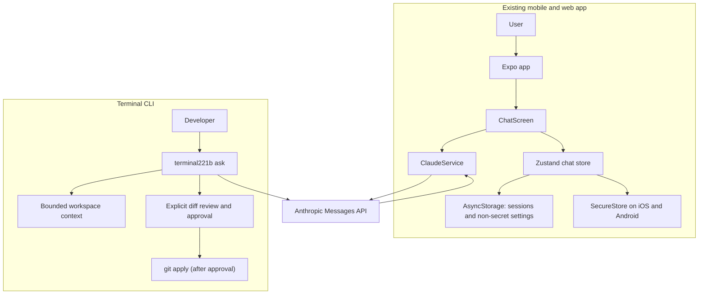

# Terminal221b

Terminal221b is an Expo/React Native chat client and an installable, local-first coding CLI.
The CLI sends selected workspace text to Anthropic and requires explicit approval before applying a proposed diff.

[](https://github.com/Bakery-street-project/Terminal221b/actions/workflows/ci.yml)

## Why it exists

The repository currently implements a single-screen Claude chat prototype. It does not implement the autonomous agents, blockchain integration, local TensorRT inference, or economic loop described in the previous README.

## Architecture



`App.tsx` loads the persisted store. `ChatScreen` handles the chat UI and settings for a user-provided API key. `ClaudeService` sends the conversation to Anthropic and returns the first text block in the response. The native app keeps the API key in SecureStore; web builds keep it in memory only.

## Quickstart

### Requirements

- Node.js 22
- npm
- Expo Go or a configured iOS/Android development environment for native use
- An Anthropic API key for live chat requests

### Install and run

```sh
git clone https://github.com/Bakery-street-project/Terminal221b.git
cd Terminal221b
npm ci
npm run start
```

Open the project in Expo Go or a configured simulator. In the app, open **Settings**, enter your own API key, save it, then send a chat message.

To start the web development server, run `npm run web`. To create the web export used by CI, run `npm run build`; output is written to the ignored `dist/` directory. Web storage is not secure for API keys, so the app keeps the key in memory only on web and live browser API calls have not been verified.

### Environment

The mobile app does not load API keys from `.env` files. The terminal CLI reads `ANTHROPIC_API_KEY` from the invoking process environment; never use `EXPO_PUBLIC_*` for secrets because client bundle values are public.

## Usage

After saving a key in Settings, type a message and select **Send**. The app submits the message history and displays the first text block returned by the API. Exact model output varies and a live API response was not captured for this change.

The deterministic service test uses this input and mocked response:

```text
Input message: Hello
Mock API text block: A mocked reply
ClaudeService result: A mocked reply
```

The test validates request headers, model and token defaults, and error handling without making a network request.

## Terminal CLI

The separate `@terminal221b/cli` workspace builds the `terminal221b` command with Node.js 22 or later. It is currently an early CLI, not a full-screen terminal UI or autonomous agent.

```sh
npm ci
npm run build:cli
npm run cli -- ask --workspace . "Summarize the source layout"
```

The CLI reads a bounded set of text files (up to 80 files and 256 KB total), skips hidden files, symlinks, dependency/build folders, and common environment files, then sends that context and the prompt to Anthropic. Set `ANTHROPIC_API_KEY` in the shell before using it. Files leave the machine for the configured Anthropic endpoint; do not run it on a workspace you are not willing to share with that provider.

To request a code change, add `--apply`. The CLI accepts only a unified diff, rejects workspace traversal, symlink paths, binary diffs, and secret-file destinations, validates the patch with `git apply --check`, shows the diff, and writes only if you type `APPLY`. It never executes model-generated shell commands.

To install just the CLI into a temporary user prefix for a smoke test:

```sh
npm pack --workspace @terminal221b/cli --pack-destination /tmp
npm install --global --prefix /tmp/terminal221b-prefix /tmp/terminal221b-cli-0.1.0.tgz
/tmp/terminal221b-prefix/bin/terminal221b --help
```

For normal use, install into a user-writable prefix and add that prefix's `bin` directory to `PATH`. The package is marked private and unlicensed for redistribution under the repository's existing proprietary terms.

The CLI currently supports one Anthropic provider and one-shot prompts. It does not yet execute tools, maintain multi-turn sessions, call external bounty targets, run Solana transactions, or integrate a full security analyzer.

## Status and limitations

- Primary language: TypeScript. The app uses Expo SDK 54, React Native, Zustand, AsyncStorage, SecureStore, and the Anthropic Messages API.
- Implemented: one chat screen, locally persisted sessions, a native API-key settings field, native secure key storage, and direct text requests.
- Not implemented: blockchain or Solana features, remote bounty testing, an autonomous tool loop, TensorRT/local inference, a backend proxy, session-list/navigation UI, mobile model selection, streaming, or attachment handling.
- Chat history remains in AsyncStorage and is not encrypted. Native API keys are stored in OS secure storage. Web API keys are memory-only.
- This is a client app that sends the user-provided key directly to Anthropic; it is not suitable for embedding an operator-owned key in a distributed build.
- The web export and TypeScript checks pass locally, but no simulator/device session or live Anthropic request has been verified.
- `npm audit --omit=dev` reports unresolved advisories in the dependency tree, including critical and high severity findings. Major Expo upgrades were not applied automatically.
- The repository retains its proprietary license; it is not MIT-licensed.

## Roadmap

1. Add store tests for storage migration, key handling, and session lifecycle.
2. Add CLI session history and a terminal interface after the one-shot workflow is stable.
3. Add local-only source/dependency security checks with explicit workspace scope and reviewable fixes.
4. Add optional Solana/SVM tool discovery and safe local development profiles; never handle wallet secrets or broadcast transactions.
5. Review and resolve dependency advisories without an untested Expo major upgrade.

## Support

The repository links to both GitHub Sponsors profiles for voluntary support only. There are no paid features; Sponsor checkout and payout have not been verified.

## Contributing

See [CONTRIBUTING.md](CONTRIBUTING.md) for local checks.

## License

The repository is distributed under the terms in [LICENSE](LICENSE). The license is proprietary; do not redistribute or reuse it without permission.

## Security

See [SECURITY.md](SECURITY.md). Do not place API keys in Expo public environment variables or commit them to the repository.
