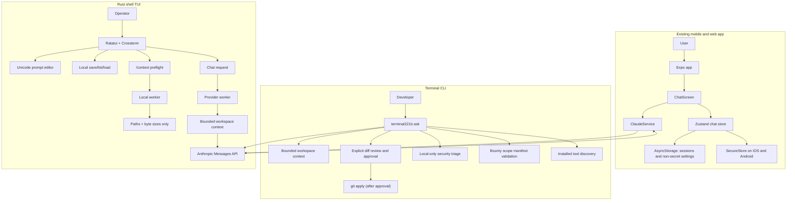

# Terminal221b

Terminal221b is an Expo/React Native chat client and an installable, local-first coding CLI.
The CLI sends selected workspace text to Anthropic and requires explicit approval before applying a proposed diff.

[](https://github.com/Bakery-street-project/Terminal221b/actions/workflows/ci.yml)

## Why it exists

The mobile app remains a single-screen Claude chat client. Separate TypeScript CLI and Rust TUI packages provide bounded local-workspace context, local security triage, and reviewed patch workflows. The repository does not implement autonomous multi-agent orchestration, blockchain transactions, local TensorRT inference, or an economic loop.

## Architecture



`App.tsx` loads the persisted store. `ChatScreen` handles the chat UI and settings for a user-provided API key. `ClaudeService` sends the conversation to Anthropic and returns the first text block in the response. The native app keeps the API key in SecureStore; web builds keep it in memory only.

## Quickstart

### Requirements

- Node.js 22
- npm
- Expo Go or a configured iOS/Android development environment for native use
- An Anthropic API key for live chat requests

### Install and run

```sh
git clone https://github.com/Bakery-street-project/Terminal221b.git
cd Terminal221b
npm ci
npm run start
```

Open the project in Expo Go or a configured simulator. In the app, open **Settings**, enter your own API key, save it, then send a chat message.

To start the web development server, run `npm run web`. To create the web export used by CI, run `npm run build`; output is written to the ignored `dist/` directory. Web storage is not secure for API keys, so the app keeps the key in memory only on web and live browser API calls have not been verified.

### Environment

The mobile app does not load API keys from `.env` files. The terminal CLI reads `ANTHROPIC_API_KEY` from the invoking process environment; never use `EXPO_PUBLIC_*` for secrets because client bundle values are public.

## Usage

After saving a key in Settings, type a message and select **Send**. The app submits the message history and displays the first text block returned by the API. Exact model output varies and a live API response was not captured for this change.

The deterministic service test uses this input and mocked response:

```text
Input message: Hello
Mock API text block: A mocked reply
ClaudeService result: A mocked reply
```

The test validates request headers, model and token defaults, and error handling without making a network request.

## Terminal CLI

The `@terminal221b/cli` workspace builds the `terminal221b` command with Node.js 22 or later. The Rust workspace adds an original full-screen terminal interface using Ratatui and Crossterm.

```sh
npm ci
npm run build:cli
npm run cli -- ask --workspace . "Summarize the source layout"
```

Build and launch the Rust TUI:

```sh
cargo build --release -p terminal221b-tui
cargo install --path packages/rust-tui --locked
terminal221b tui .
```

The TUI supports multi-turn Anthropic chat, a crypto-focused system prompt via `/crypto`, tool discovery via `/tools`, a local analyzer run via `/scan`, `/apply <request>` for a proposed unified diff, and local transcript commands `/save <name>`, `/sessions`, and `/load <name>`. It previews all patch paths and diff text; press `y` to apply or `n` to reject. `Enter` submits, `Shift+Enter` inserts a line break, the arrow keys edit the prompt, and `Home`/`End` move to the current line boundaries (`Ctrl+A`/`Ctrl+E` are also supported). `PageUp`/`PageDown` scroll the conversation by a viewport-sized page and clamp at its oldest/newest content. Set `ANTHROPIC_API_KEY` in the environment; `TERMINAL221B_MODEL` optionally selects a model. The TUI uses bounded local context and does not execute model-generated commands.

Saved sessions contain only user and assistant transcript turns; system messages, the workspace path, automatically collected workspace context, provider configuration, and API keys are not saved. Obvious API-token assignments, bearer tokens, and private-key blocks are redacted before writing, but local transcript files are plain text and this heuristic is not a guarantee that every secret is detected. On Unix, the session directory is restricted to mode `0700` and files to `0600`; on Windows, files use inherited directory permissions. Storage is atomic and local: `$XDG_STATE_HOME/terminal221b/sessions` when set, otherwise `~/.local/state/terminal221b/sessions` on Unix, or `%LOCALAPPDATA%/terminal221b/sessions` on Windows. Session names are limited to 48 lowercase ASCII letters, digits, hyphens, and underscores.

The terminal interface is an actual shell TUI, so it uses Ratatui/Crossterm rather than Tauri. Tauri is a desktop-webview framework; a Tauri desktop wrapper is not part of this terminal release. See the [TUI architecture decision](docs/TUI-ARCHITECTURE.md) for a researched comparison of agent TUI stacks and the reasons this project stays with Rust/Ratatui.

The TUI command `/context` locally previews the selected workspace file paths and byte sizes without printing source bodies or contacting Anthropic. A future request re-collects context, so the displayed selection may change if files change. The CLI reads a bounded set of text files (up to 80 files and 256 KB total), skips hidden files, symlinks, dependency/build folders, and common environment files, then sends that context and the prompt to Anthropic. Set `ANTHROPIC_API_KEY` in the shell before using it. Files leave the machine for the configured Anthropic endpoint; do not run it on a workspace you are not willing to share with that provider.

To request a code change, add `--apply`. The CLI accepts only a unified diff, rejects workspace traversal, symlink paths, binary diffs, and secret-file destinations, validates the patch with `git apply --check`, shows the diff, and writes only if you type `APPLY`. It never executes model-generated shell commands.

For crypto-focused text chat about project architecture, protocol/NFT ideas, or market mechanics:

```sh
terminal221b crypto ask --workspace ./my-project "Review this Solana program's account model"
```

This mode sends the selected local text context to Anthropic like `ask`; it is not a live market-data feed or autonomous agent. It does not provide personalized investment recommendations, place trades, sign transactions, manage wallet keys, or contact bounty targets.

### Local security triage and toolchains

```sh
terminal221b security scan --workspace .
terminal221b tools
terminal221b scope validate examples/bounty-scope.example.json
```

`security scan` runs built-in heuristics and only runs optional analyzers explicitly selected by flags:

```sh
terminal221b security scan --workspace . \
  --with-gitleaks --with-bandit --with-semgrep --with-trivy \
  --with-slither --with-cargo-audit
```

Gitleaks and Bandit scan local files; Semgrep uses bundled local rules with metrics disabled; Trivy runs offline and skips database updates; Slither examines discovered Solidity files without invoking a project build; cargo-audit uses the cached advisory database with fetching disabled. Findings are reduced to path, line, rule, and severity; scanner source excerpts and secret values are not printed. Trivy requires a previously cached vulnerability database for dependency findings, and cargo-audit requires a cached advisory database. Update those databases separately when network access is permitted. These tools are not a complete security review and findings are not proof of exploitability. `tools` only checks whether supported tools are on `PATH`; it neither executes nor installs them.

The scope manifest is data for local review only. Wildcards and non-HTTPS targets are rejected; out-of-scope paths override an in-scope path prefix. Terminal221b currently has no remote target-testing feature. Do not test any program asset without checking its current rules and obtaining authorization.

Built-in scans use deterministic local heuristic patterns. Gitleaks and Bandit run only if explicitly selected with `--with-gitleaks` or `--with-bandit`; Gitleaks scans the selected workspace, while Bandit receives the Python source files found by Terminal221b. Both are local-only, capture structured output, discard secret values returned by scanners, and print only the finding path/rule/line. Other discovered analyzers are not invoked automatically.

For Omarchy/Arch Linux, `terminal221b setup omarchy --dry-run` prints a package plan. It queries enabled official pacman package metadata but never installs packages, elevates privileges, builds AUR packages, or runs upstream installers. AUR candidates require manual `PKGBUILD` and source review. Gitleaks, Trivy, and cargo-audit are available from official Arch repositories. Foundry's upstream installer verifies release binary hashes; Slither and Semgrep can be isolated with pipx. Solana CLI and Anchor/AVM follow their upstream installation instructions. This project does not install host tools automatically.

To install just the CLI into a temporary user prefix for a smoke test:

```sh
npm pack --workspace @terminal221b/cli --pack-destination /tmp
npm install --global --prefix /tmp/terminal221b-prefix /tmp/terminal221b-cli-0.1.0.tgz
/tmp/terminal221b-prefix/bin/terminal221b --help
```

For normal use, install into a user-writable prefix and add that prefix's `bin` directory to `PATH`. The package is marked private and unlicensed for redistribution under the repository's existing proprietary terms.

The CLI currently supports one Anthropic provider and one-shot prompts. It does not execute model-directed tools, maintain multi-turn sessions, call external bounty targets, run Solana transactions, or replace dedicated security analyzers. Crypto ideas and project analysis can be discussed with the existing chat prompt, but the CLI does not trade NFTs/tokens, manage wallets, or submit bounty reports.

## Status and limitations

- Primary language: TypeScript; the coding TUI is a Rust/Cargo package. The app uses Expo SDK 54, React Native, Zustand, AsyncStorage, SecureStore, and the Anthropic Messages API.
- Implemented: one chat screen, locally persisted sessions, a native API-key settings field, native secure key storage, direct text requests, a Rust TUI with local transcript save/list/load, Unicode-aware prompt editing, viewport conversation navigation, and local `/context` disclosure preview.
- Not implemented: blockchain or Solana transaction features, remote bounty testing, a general autonomous tool loop, TensorRT/local inference, a backend proxy, cross-run session persistence, mobile model selection, streaming, or attachment handling.
- Chat history remains in AsyncStorage and is not encrypted. Native API keys are stored in OS secure storage. Web API keys are memory-only.
- This is a client app that sends the user-provided key directly to Anthropic; it is not suitable for embedding an operator-owned key in a distributed build.
- The web export and TypeScript checks pass locally, but no simulator/device session or live Anthropic request has been verified.
- `npm audit --omit=dev` reports unresolved advisories in the dependency tree, including critical and high severity findings. Major Expo upgrades were not applied automatically.
- The repository retains its proprietary license; it is not MIT-licensed.

## Roadmap

1. Add cancellable provider requests, streaming responses, and explicit offline/error states.
2. Add a separate Tauri desktop frontend if there is a clear desktop UX need; the shell TUI remains independent.
3. Design evidence-backed agent profiles and a typed TUI/provider boundary before adding role-specific prompt behavior.
4. Expand local Solana/SVM development profiles; tool discovery alone does not configure or run chain tools.
5. Review and resolve dependency advisories without an untested Expo major upgrade.

## Support

The repository links to both GitHub Sponsors profiles for voluntary support only. There are no paid features; Sponsor checkout and payout have not been verified.

## Contributing

See [CONTRIBUTING.md](CONTRIBUTING.md) for local checks.

## License

The repository is distributed under the terms in [LICENSE](LICENSE). The license is proprietary; do not redistribute or reuse it without permission.

## Security

See [SECURITY.md](SECURITY.md). Do not place API keys in Expo public environment variables or commit them to the repository.
