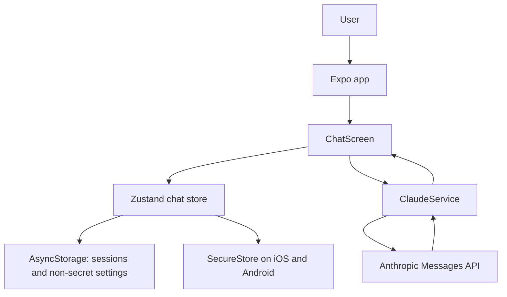

# Terminal221b

Terminal221b is an Expo and React Native chat client that sends conversations to the Anthropic Messages API.
It stores chat sessions locally and stores native API keys with the device secure-storage API.

[](https://github.com/Bakery-street-project/Terminal221b/actions/workflows/ci.yml)

## Why it exists

The repository currently implements a single-screen Claude chat prototype. It does not implement the autonomous agents, blockchain integration, local TensorRT inference, or economic loop described in the previous README.

## Architecture



`App.tsx` loads the persisted store. `ChatScreen` handles the chat UI and settings for a user-provided API key. `ClaudeService` sends the conversation to Anthropic and returns the first text block in the response. The native app keeps the API key in SecureStore; web builds keep it in memory only.

## Quickstart

### Requirements

- Node.js 22
- npm
- Expo Go or a configured iOS/Android development environment for native use
- An Anthropic API key for live chat requests

### Install and run

```sh
git clone https://github.com/Bakery-street-project/Terminal221b.git
cd Terminal221b
npm ci
npm run start
```

Open the project in Expo Go or a configured simulator. In the app, open **Settings**, enter your own API key, save it, then send a chat message.

To start the web development server, run `npm run web`. To create the web export used by CI, run `npm run build`; output is written to the ignored `dist/` directory. Web storage is not secure for API keys, so the app keeps the key in memory only on web and live browser API calls have not been verified.

### Environment

The app does not load API keys from `.env` files. `.env.example` documents this intentionally: do not expose an Anthropic key through an `EXPO_PUBLIC_*` variable because client bundle values are public.

## Usage

After saving a key in Settings, type a message and select **Send**. The app submits the message history and displays the first text block returned by the API. Exact model output varies and a live API response was not captured for this change.

The deterministic service test uses this input and mocked response:

```text
Input message: Hello
Mock API text block: A mocked reply
ClaudeService result: A mocked reply
```

The test validates request headers, model and token defaults, and error handling without making a network request.

## Status and limitations

- Primary language: TypeScript. The app uses Expo SDK 54, React Native, Zustand, AsyncStorage, SecureStore, and the Anthropic Messages API.
- Implemented: one chat screen, locally persisted sessions, a native API-key settings field, native secure key storage, and direct text requests.
- Not implemented: blockchain or Solana features, autonomous agents, TensorRT/local inference, a backend proxy, session-list/navigation UI, model selection, streaming, or attachment handling.
- Chat history remains in AsyncStorage and is not encrypted. Native API keys are stored in OS secure storage. Web API keys are memory-only.
- This is a client app that sends the user-provided key directly to Anthropic; it is not suitable for embedding an operator-owned key in a distributed build.
- The web export and TypeScript checks pass locally, but no simulator/device session or live Anthropic request has been verified.
- `npm audit --omit=dev` reports unresolved advisories in the dependency tree, including critical and high severity findings. Major Expo upgrades were not applied automatically.
- The repository retains its proprietary license; it is not MIT-licensed.

## Roadmap

1. Add store tests for storage migration, key handling, and session lifecycle.
2. Add session navigation and model selection.
3. Add request cancellation and clearer network/offline states.
4. Decide whether a backend proxy is needed before distributing builds beyond personal use.
5. Review and resolve dependency advisories without an untested Expo major upgrade.

## Support

The repository links to both GitHub Sponsors profiles for voluntary support only. There are no paid features; Sponsor checkout and payout have not been verified.

## Contributing

See [CONTRIBUTING.md](CONTRIBUTING.md) for local checks.

## License

The repository is distributed under the terms in [LICENSE](LICENSE). The license is proprietary; do not redistribute or reuse it without permission.

## Security

See [SECURITY.md](SECURITY.md). Do not place API keys in Expo public environment variables or commit them to the repository.
