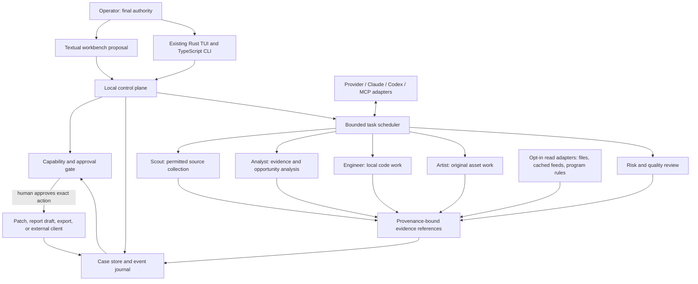

# Terminal221b: Agentic System and Economic Loop

**Status:** design proposal. Phases 0 and 1 below are implemented in the TypeScript CLI; everything else in this document is proposed, not implemented.  
**Date:** 2026-09-30.  
**Scope:** multi-agent architecture, Textual information architecture, coding-agent integration, bounty discovery/ranking, Analyst/Artist/Engineer roles, and Solana/NFT boundaries.
**Implementation status:** see §10 and §11. Phase 0 contracts and the Phase 1 eligibility gate, ordinal ranking, and dossier export exist in `packages/cli/src/case.ts`, `case-fixtures.ts`, `ranking.ts`, and `dossier.ts`, and are read through `terminal221b case dossier`. The local case store (§10) exists in `packages/cli/src/store.ts` and `path-guard.ts`, reached through `terminal221b case store init|put|get|verify` and `case sign`, and documented in [CASE-STORE.md](TERMINAL221B-CASE-STORE.md). The freshness gate is reviewed in [FRESHNESS-REVIEW.md](TERMINAL221B-FRESHNESS-REVIEW.md). They are offline and local-only: no adapter, no source reader, no orchestration, no target request, and no agent of any kind. The threat model and its open findings are in [TERMINAL221B-CASE-THREAT-MODEL.md](TERMINAL221B-CASE-THREAT-MODEL.md).

This is a systems blueprint, not an AI-SPEC generated through the GSD workflow. The required `.Codex/gsd-core/workflows/ai-integration-phase.md` was not present in the project or global install. No agent framework, remote data source, target-testing feature, wallet integration, or payment system was added.

## 1. Executive decision

Build Terminal221b as a **local operator workbench with a deterministic control plane and optional, explicitly authorized specialist agents**. Treat each data source and coding runtime as an adapter behind a typed contract. Put durable work into reviewable cases, not free-form agent chat. Let AI propose observations, analyses, drafts, and patches; keep scope decisions, patch writes, bounty submission, art publication, and financial actions with the human.

Keep the existing surfaces intact:

- Expo/React Native remains the existing chat client.
- The TypeScript CLI remains a bounded, one-shot Anthropic client with local scan/scope tooling.
- The Rust/Ratatui/Crossterm TUI remains the shipped shell interface.
- A Textual TUI is a separately proposed information-workbench prototype. It is not a framework migration or a second shipped client until a prototype demonstrates a distinct operator need.

The strongest product wedge is not “agents hunt and earn autonomously.” It is a **traceable opportunity-to-evidence workbench**: collect permitted signals, verify the current rules, rank with explainable evidence, assign a bounded task, validate the artifact, and let the operator choose what happens next.

## 2. Current state versus proposed state

### Verified in the current repository

- The mobile/web product is an Expo/React Native chat app with Zustand, AsyncStorage, native SecureStore, and direct Anthropic messages.
- The TypeScript CLI includes Anthropic chat, bounded workspace context, human-confirmed diff application, local security scans, tool discovery, strict scope-manifest validation, a crypto discussion prompt, and a local offline case dossier (`case dossier`) built on versioned case/source/evidence/task/approval/outcome contracts. It makes no bounty target requests and has no general model-directed tool loop.
- The Rust TUI supports multi-turn Anthropic chat, a bounded workspace reader, optional local analyzer commands, reviewed patch application, transcript save/list/load, prompt editing/navigation, and `/context` path/byte preflight.
- GitHub Sponsors is voluntary. There is no payment processing, verified revenue, active trading, wallet custody, remote bounty testing, or on-chain transaction feature.
- Analyst, Artist, and Engineer are design seeds, not implemented independent agents. The `role` field on a task contract is a label; nothing dispatches work.

Source of truth: current `README.md`, `packages/cli/src/cli.ts`, `packages/cli/src/case.ts`, `packages/cli/src/ranking.ts`, `packages/cli/src/prompt.ts`, `packages/rust-tui/src/main.rs`, and `packages/rust-tui/src/workspace.rs`. Reinspect these before implementation; the proposal does not supersede source.

### Proposed additions

| Area | Proposal | Not claimed |
|---|---|---|
| Control plane | Local case/task/event coordinator with explicit capability grants | An autonomous organization or policy-enforcing sandbox |
| Specialist work | Analyst, Artist, Engineer, plus bounded Scout and Risk/Quality reviewer tasks | Independent minds, guaranteed correctness, or agent incentives |
| Data | Versioned source snapshots, provenance, freshness, scope records, evidence references | A live market feed or authoritative coverage |
| Textual IA | Optional Python operator cockpit for high-density research cases | Replacement of the existing Rust TUI |
| Coding tools | Per-runtime adapters for Claude Code/Agent SDK and Codex app-server | Uniform cross-vendor permissions or stable unversioned protocols |
| Bounty workflow | Scope-gated discovery and explainable local prioritization | Target probing, exploit automation, bounty submission, or guaranteed payout |
| Art/Solana | Local creative pipeline, metadata validation, and human-directed handoff | Minting, signing, royalty income, or market liquidity |
| Economic loop | Measured costs, verified outcomes, human-approved reinvestment | A self-funding business or passive revenue |

## 3. Multi-agent architecture

### 3.1 Separation of control and cognition

The **orchestrator is deterministic application code**, not a privileged “boss agent.” It owns task state, authorization checks, budgets, cancellation, retries, persistence, and the final audit trail. Specialist model calls are replaceable workers with the least capability needed for one task.



**Control-plane responsibilities**

- Create a case from an operator request or a specifically enabled, documented source.
- Snapshot relevant instructions, workspace identity, scope-policy version, source timestamps, and selected context before assigning work.
- Compile each task into a typed contract: goal, input references, writable paths, allowed tools, external-effect level, budget, deadline, acceptance checks, and cancellation token.
- Reject a task whose requested capability exceeds its grant. Record the denial; do not ask an LLM whether a permission check should be bypassed.
- Run independent tasks concurrently only when their write sets and effects do not conflict. Serialize edits in a shared worktree, or assign isolated worktrees and reconcile diffs.
- Normalize worker events, stream status to the UI, preserve structured errors, and stop/timeout workers on cancellation.
- Store provenance and result metadata; keep secrets and unneeded source bodies out of the journal.
- Require an independent deterministic check or human review before promoting an agent claim to accepted case evidence.

**Specialists are bounded task profiles**

| Role | Receives | May return | Must not do |
|---|---|---|---|
| **Scout** | Named, allowed sources and freshness window | Source records, change summaries, unresolved provenance | Expand sources, probe targets, or treat snippets as verified facts |
| **Analyst** | Provenance-tagged records and operator question | Comparisons, hypotheses, uncertainty, candidate score vector | Place trades, promise alpha, or convert a hypothesis into a fact |
| **Engineer** | Explicit local repository/worktree, task contract, approved tools | Plan, tested diff, tool-event stream, test evidence | Touch paths outside grant, exfiltrate workspace, or execute unapproved commands |
| **Artist** | Original brief, owned/licensed inputs, aesthetic constraints | Local drafts, variants, metadata, provenance manifest | Imitate protected characters/living artists, publish/mint, or claim commercial rights |
| **Risk / Quality reviewer** | Candidate result plus original contract and evidence | Contradictions, missing evidence, safety and quality findings | Approve its own worker’s external effect or silently rewrite acceptance |
| **Operator / Capo** | Full case, evidence, proposed effect and cost | Approve, reject, revise, or defer | Not delegated to an agent |

The Reviewer should see the task contract and evidence, not a fabricated “independent agent consensus.” If the reviewer uses the same model/provider or shared context, disclose correlated failure risk. Deterministic checks (tests, schema validation, local scope checks) remain distinct from model critique.

### 3.2 Typed task and event contract

Keep the canonical internal protocol small and vendor-neutral. Adapters translate to vendor APIs; vendor-specific identifiers and event types stay namespaced in adapter metadata.

```text
TaskContract
  task_id, case_id, role, goal
  workspace_ref?, read_refs[]
  writable_paths[]
  capability_grant
  acceptance_checks[]
  deadline, token_or_cost_budget?, cancellation_token
  provenance_required, output_schema_version

AgentEvent
  task_started | progress | observation | tool_requested | approval_required
  diff_proposed | check_started | check_finished | finding | task_finished
  task_failed | task_cancelled

ResultEnvelope
  task_id, adapter, adapter_version, model_if_known
  status, structured_result, evidence_refs[], diff_ref?
  usage_if_reported, timestamps, warnings[]
```

Rules:

- A model-produced URI or path is a claim until the coordinator resolves and validates it.
- A tool request is proposed intent. The policy engine decides whether it is allowed; only then may an adapter invoke it.
- Unknown event versions, invalid structured output, missing provenance, timeout, or malformed patches fail closed and remain visible.
- Do not normalize away meaningful vendor approval/error states.
- Attach explicit retention classes to output: `transient`, `case_metadata`, `local_diff`, `operator_archive`. Never persist API credentials or seed phrases.

### 3.3 Permission ladder

Capability is granted to a **specific task, resource, and operation**, not inferred from role name.

| Level | Capability | Default |
|---|---|---|
| Observe | Read selected local workspace or imported fixture | Allowed within path and size limits |
| Research | Read a named public source/API | Off until source, terms, rate limits, and egress are configured |
| Analyze | Transform cached records, run deterministic local scoring | Allowed on supplied data |
| Draft | Prepare local note, report, artwork, or patch | Allowed in a designated draft area |
| Modify | Write code/artifacts or run a command | Per-task approval; command and write-set shown |
| Submit / publish | Send a report, publish an artwork or repository release | Explicit approval for exact destination/content each time |
| Sign / transfer | Sign or broadcast a transaction or move funds | Not in MVP; do not store signing keys; external wallet confirmation only if ever separately designed |

This ladder describes product policy, not operating-system isolation. Enforce with OS-level process/worktree boundaries where possible; where they do not exist, describe the limitation and keep the operation out of scope.

### 3.4 Persistence and observability

Proposed local state: relational case/task/source/evidence records in a local database, plus an append-only event table committed transactionally with state transitions. Export a human-readable case bundle for review. Before selecting SQLite or another store, prototype locking, backup, corruption recovery, and schema migrations; no database is present in the current product.

Persist:

- IDs, source URI/owner, retrieved/observed time, policy version/hash, and content hash.
- Case state, task contract, approval decision, tool identity/version, exit state, artifact paths and digests.
- Cost/usage only when the provider reports it; distinguish estimates from invoices and actual charges.

Do not persist by default:

- Raw wallet keys, auth tokens, signing material, or provider credentials.
- Full source trees or transcripts already stored by external coding clients.
- Private program material beyond the operator-selected local case retention.
- Raw scanner output containing secret values.

## 4. Economic generative loop

This loop is a **value-creation and learning model**, not a financial forecast:

```text
Operator time + permitted data + tool/provider spend
  → opportunity intake and policy check
  → bounded Analyst/Engineer/Artist work
  → verified artifact (code fix, report draft, research brief, original asset)
  → human decision / external acceptance
  → observed outcome and measured cost
  → operator-approved reinvestment in skills, tests, tooling, and source quality
  → better future selection and lower avoidable rework
```

### 4.1 Distinguish value from cash

- **Value generated:** useful evidence, code quality, reusable local tooling, an original artwork, or reduced manual effort. Record evidence of use rather than assigning an invented dollar amount.
- **Cash received:** only record after an external payment is actually confirmed. A bounty listing, submitted report, “likely severity,” sponsor badge, or market price is not income.
- **Costs:** record provider-reported usage where available, actual tool/service invoices, and operator time as separate categories. Estimated cost must be labeled estimated. Do not claim profitable automation without matched outcomes and costs.
- **Funding:** voluntary GitHub Sponsors remains the current support boundary. Bounty awards and art sales are conditional future channels, not guaranteed or built-in.
- **Reinvestment:** the operator decides whether verified value/outcomes justify further time or spend. No automatic treasury, wallet, subscription purchase, or transfer.

### 4.2 Feedback signals

Collect only metrics that can be observed reliably:

- Opportunity → scope-verified → researched → reproducible → owner-reviewed → submitted by owner → accepted/rejected/duplicate, with timestamps and source evidence.
- Hours spent by stage and provider/tool costs actually reported.
- Findings rejected for stale scope, missing reproduction, out-of-scope asset, or duplicate evidence.
- Art drafts approved, revised, abandoned, or externally used; do not infer revenue from views or floor prices.
- Engineer patches passing tests, being merged by a human, or later reverted.

Use these to identify wasted work and improve source/rubric selection. Start with descriptive cohort reports. Do not claim causal improvement from a small or selected sample.

### 4.3 Failure and anti-loop controls

- Stop repeated research when policy is stale, scope ambiguous, evidence is duplicative, or the task budget is exhausted.
- Do not reward agents by payout, token count, severity, trading return, or number of reports. Such incentives invite fabricated findings and unsafe escalation.
- Separate “potential reward published by program” from “expected value.” Do not calculate payout odds until there is a verified, representative outcomes dataset and a reviewed model.
- Preserve a human decision record for funding, asset publication, report submission, and any external commitment.

## 5. Textual TUI information architecture

Textual is proposed for a **research-heavy workbench** because its Python App/event/widget model may suit dense case views. This proposal does not overturn the existing Rust/Ratatui ruling. First validate a short-lived prototype with static fixtures; do not duplicate the Rust TUI's general chat or provider plumbing.

### 5.1 Global frame

```text
┌ Terminal221b ─ workspace / case ─ data freshness ─ provider state ─┐
│ command palette   Overview  Radar  Bounties  Studio  Engineer  Log │
├───────────────────────────────────────────────────────────────────┤
│ left: saved views / filters │ center: selected queue or case       │
│                             │                                      │
│                             │ right: evidence / provenance / action│
├───────────────────────────────────────────────────────────────────┤
│ status: local/remote mode · last refresh · pending approvals · cost│
└───────────────────────────────────────────────────────────────────┘
```

Use a persistent command palette, focusable panes, keyboard-first list navigation, and mouse as an enhancement. Reflow to stacked screens when narrow; never hide approval or data-freshness state behind hover-only controls.

### 5.2 Screens and operator questions

| Screen | Operator question | Primary region | Required provenance/state |
|---|---|---|---|
| **Overview / Watch** | What changed, what is stale, and what needs my decision? | Pending approvals, active cases, source-health list, recent verified events | Last refresh, source status, local/cloud boundary, no fabricated aggregate “alpha” |
| **Radar** | Which market/protocol signals merit research? | Filterable event stream and selected-record detail | Source, observed time, symbol/asset identity, raw-vs-derived badge, uncertainty; no buy/sell action |
| **Bounties** | Which listed programs and candidate issues are both in scope and worth local investigation? | Program/candidate queue, rubric vector, selected dossier | Program policy snapshot/hash/time, exact asset and eligibility, exclusions, bounty bands as source-reported |
| **Case dossier** | What do we know, what is missing, and what is the next safe step? | Evidence timeline, assumptions, artifacts, task queue, approval pane | Claim-to-source links, provenance, reviewer disagreements, state transition history |
| **Studio** | How can I make an original asset responding to this research? | Brief, reference/licensing panel, local drafts, provenance manifest | Input rights/source, prompt/model if known, local artifact hash, user publishing decision |
| **Engineer bay** | Can this code task be implemented and verified safely? | Workspace, task contract, client session, diff/test stream | Exact worktree, writable paths, tool permissions, approval request, exit codes |
| **Ledger / Outcomes** | What did we spend, what happened, and what did we learn? | Case outcomes, time/cost records, decisions, source freshness | Actual vs estimate, received vs expected, no inferred revenue or automatic allocation |

### 5.3 Interaction contracts

- Every queue row has a stable ID and opens a dossier; filters never destroy state.
- `Inspect` is read-only. `Start task` shows the contract, selected sources, context disclosure, provider/client, and budget before dispatch.
- `Approve` applies only to one named effect and one bounded payload. It is not blanket approval for later tool calls.
- `Pause`, `cancel`, and `reject` are available during agent work; late events from cancelled tasks are retained as cancelled output and cannot mutate state.
- A status chip uses text as well as color: `LOCAL`, `REMOTE READ`, `STALE`, `UNVERIFIED`, `APPROVAL REQUIRED`.
- High-impact or externally visible actions use a review screen with destination, exact diff/content, evidence references, and consequences.
- Do not show a live price/score badge when no live or verified data source exists. Fixture mode must be visibly labeled.

### 5.4 Textual implementation boundary

If approved for a prototype:

- Python `App` composes screens, global bindings, navigation, and status state.
- Separate `Screen`/widget groups implement Radar, Bounties, Dossier, Studio, Engineer, and Ledger. Keep domain ranking and policy logic in pure Python modules with deterministic fixtures.
- Textual workers perform network/file/model work away from UI updates; messages update the view. Cancellation must propagate to adapters and subprocesses.
- A repository service owns validated local records and evidence references; do not let widgets call external providers directly.
- Keep the first prototype offline and read-only. Use fixture records to test empty/stale/error/loading/action-confirmation states before source adapters.
- Do not share code with the Rust TUI through subprocess scraping. Define a versioned local data contract if the surfaces later need shared cases.

## 6. Engineer agent, Claude Code and Codex integration

### 6.1 Integration posture

Treat Claude Code, Codex, Copilot, and future clients as **external execution runtimes**, not soldiers the Engineer can silently command. The host adapter starts a user-selected client only for a task whose workspace, permissions, context, and acceptance are explicit. The user may also run the client directly; Terminal221b should not proxy credentials or represent itself as the client vendor.

### 6.2 Adapter strategies

**Claude**

- For an embedded, structured agent loop, evaluate the official Claude Agent SDK. Its documentation describes built-in tools, permissions, sessions, hooks, subagents, MCP, and plugins. It runs the Claude Code binary and is distinct from the direct Anthropic Client SDK currently used by the product.
- For one-off fallback only, the Claude Code CLI supports print mode (`claude -p`) and JSON output according to the official CLI reference. Prefer machine-readable output; verify the installed version and output schema before relying on flags. Do not parse terminal-rendered UI.
- Do not treat hooks as a security boundary. They are integration callbacks, not OS isolation; keep a coordinator gate and OS-enforced workspace restrictions.
- Respect Anthropic terms: the Agent SDK docs state third-party products must not offer Claude.ai login/rate limits as their own; use supported API-key authentication and disclose who pays.

**Codex**

- Evaluate `codex app-server` for a rich client integration. Official docs describe bidirectional JSON-RPC, local `stdio` JSONL, thread/turn lifecycle, streamed events, approvals, and version-matched generated TypeScript/JSON schemas.
- Prefer local stdio or the documented local Unix socket for an on-machine integration. Do not expose the server over a non-loopback network. The official docs mark WebSocket transport experimental/unsupported and describe non-loopback authentication concerns.
- Pin/test the app-server version and generate schemas from that exact binary; do not hand-maintain assumed protocol types or confuse JSON-RPC with MCP.
- If only scripted jobs are needed, evaluate the official Codex SDK instead of driving its interactive TUI.

**MCP and CLI clients**

- MCP can expose Terminal221b case/evidence queries and explicitly gated tools to clients that support it. Start read-only; separate tools by capability and require an operator-mediated approval for mutation.
- A generic process adapter may invoke a configured CLI with argument arrays (never a shell-concatenated prompt), restricted cwd/env, bounded stdout/stderr, timeout, cancellation, and explicit exit status. No credentials in argv or task records.
- Client-specific integrations are optional. Copilot skills instruct the host; plugins package capabilities; neither makes model permissions equivalent across runtimes.
- Do not install an external plugin by default. Inventory available skills/plugins and current client docs; request operator approval for new packages, global config changes, or MCP servers.

### 6.3 Engineer task lifecycle

1. **Intake:** Convert the operator request into a task contract and identify repo, exact write set, data sent to a provider, and acceptance checks.
2. **Context manifest:** List selected files by path/hash/size first; send contents only after the user has selected a compatible provider and approved the disclosure. Follow existing workspace exclusions.
3. **Plan:** Ask the selected coding runtime for a concise plan for multi-file/risky work; do not require hidden chain-of-thought.
4. **Execute:** Run within an isolated worktree where possible. Each tool request carries task/capability identity and is independently checked.
5. **Stream:** Map vendor events to normalized progress/diff/approval/check/error events; preserve original payload references for debugging.
6. **Verify:** Run deterministic commands from the repository's documented scripts. A model saying “tests pass” is not test evidence.
7. **Review:** Show changed paths, diff, test results, provenance, and unresolved concerns. A different reviewer is useful but is not a guarantee.
8. **Apply/close:** Human approves exact patch application/commit/PR operation separately. No auto-push or merge.
9. **Learn:** Save minimal outcome metadata and actual reported spend, not raw credentials or a second copy of the workspace.

### 6.4 Failure contract

Timeout, adapter exit, malformed events, unsupported capability, permission denial, user cancellation, or missing schema are distinct visible outcomes. Never convert them into an empty successful response. Retrying is a new bounded attempt with an idempotency key where the provider allows one; do not repeat external side effects automatically.

## 7. Bounty discovery and scoring engine (explainable by design)

### 7.1 Safe scope

The current CLI validates scope-manifest metadata and explicitly does not send target requests. The first bounty engine should therefore be a **program catalog, policy snapshot, local candidate triage, and evidence organizer**. It does not scan remote assets.

Program data can enter by manual import or a later, specifically authorized read-only platform adapter. Keep platform terms, API limits, policy timestamps, attribution, and source provenance. Scope is not implied by domain similarity: exact asset identity and current program policy are required. Program rules can change; every case pins the snapshot it was evaluated against. Out-of-scope exclusions and testing constraints take precedence over an apparent match.

### 7.2 Intake and gates

1. Import program identity, policy URL, fetched/entered time, allowed asset identifiers, excluded assets, report requirements, reward schedule as published, and testing constraints.
2. Normalize assets without widening wildcards. Record original value and canonical identity; reject ambiguous normalization for review.
3. Require an operator to confirm current program rules and the specific asset before any real testing. The first release never performs that testing.
4. Ingest a candidate from local scanner output, a code review, or a user-authored lead; do not synthesize a vulnerability claim from a bounty description.
5. Deduplicate against local cases by asset, root cause, component, and evidence fingerprint; similarity is a lead, not proof of duplicate.
6. Build evidence from local fixtures/source and deterministic tests. A report draft remains local until a human submits it through the program's authorized channel.

### 7.3 Ranking without false precision

No labeled historical accepted/rejected outcomes were verified. Do **not** ship arbitrary weighted “expected payout” scores, payout probabilities, or an unexplained 0–100 number. Use an explainable ordinal score vector and deterministic status gates:

```text
Eligibility gate:
  BLOCKED        scope absent, asset excluded, authorization unknown, or policy stale
  REVIEW         policy/asset match needs operator confirmation
  ELIGIBLE       exact asset and current policy confirmed for this workflow

Candidate vector (each field: unknown | low | medium | high, with evidence refs):
  impact_fit       mapped to the program's own severity/reward rubric
  evidence_quality source integrity, affected component, and claim support
  reproducibility  deterministic local reproducer or test evidence
  novelty          duplicate search coverage and similarity caveat
  effort           coarse operator estimate, not money or a deadline promise
  reward_fit       source-published range/category, not expected value
  freshness        age/status of the policy and supporting evidence
```

**Ordering rule:** only `ELIGIBLE` candidates enter the actionable queue. Rank lexicographically by the program-defined impact category, evidence quality, reproducibility, novelty review status, then lower effort; show freshness as a visible gate and tie-break only where the policy snapshot remains valid. Unknowns never score as favorable. Do not aggregate with weights until representative, adjudicated outcomes exist, a calibration protocol is reviewed, and offline evaluation demonstrates the ranking is not misleading.

**Queue labels**

- `BLOCKED`: exact scope/policy/authorization gate failed or is unknown.
- `REVIEW`: policy freshness, asset identity, or program rule needs a human check.
- `RESEARCH`: plausible local lead, but missing evidence or reproducibility.
- `READY FOR OWNER REVIEW`: current policy confirmed, local evidence references attached, duplicate search described, and report draft validated.
- `SUBMITTED BY OWNER`: manually recorded submission; no automatic submission.
- `ACCEPTED / DUPLICATE / REJECTED / PAID`: only after the owner records verifiable external disposition. `PAID` requires confirmed receipt, not a published reward.

Every displayed rank expands to factor-by-factor reason, source, timestamp, and uncertainty. The deterministic gate is a fail-closed policy mechanism, not a claim of mathematical accuracy about impact or reward.

### 7.4 Evaluation plan

- Golden fixtures cover exact in-scope, excluded subdomain, stale policy, wildcard, similar but distinct asset, program with no bounty for asset type, ambiguous asset normalization, duplicate lead, and no-evidence lead.
- Property tests: adding an exclusion never increases eligibility; removing scope cannot make a candidate eligible; unknown evidence cannot improve a factor; changing unrelated metadata does not reorder a case.
- Historical replay, only when owner-approved and privacy-safe: compare proposed queue ordering against actual human dispositions. Separate coverage, precision at reviewed slots, false eligibility, and time saved; do not infer payout probability from small samples.
- Red-team prompts attempt scope expansion, policy laundering, stale-source use, fabricated evidence, payout exaggeration, and report auto-submission.
- No live targets in acceptance tests. If a future user requests testing, require exact program, asset, allowed method, date, rate constraints, and per-operation confirmation; default deny.

## 8. Analyst / Artist / Engineer trinity for Solana and NFT work

The trinity is a **case collaboration model**, not three autonomous agents with wallets.

### Analyst — signals and evidence

- Inputs: opted-in public market/protocol metadata, local program snapshots, repository artifacts, and source-linked research.
- Outputs: observed facts, hypotheses, confidence rationale, policy/data freshness, and next evidence request.
- Solana work: inspect account/program architecture, upgrade authority disclosures, transaction/event metadata from permitted sources, and risk assumptions. Separate on-chain observations from market interpretation.
- Prohibitions: no trading signal presented as guaranteed alpha, no price prediction without data/method, no signing, no asset movement, no unsourced “whale” conclusions.

### Artist — original creative production

- Inputs: approved creative brief, cleared reference materials, cultural/context notes, and an explicit originality policy.
- Outputs: local concept variants, editable source, optimized assets, metadata draft, and a provenance/rights manifest.
- Solana/NFT work: validate local metadata schema and asset references against the chosen standard; provide devnet-only rehearsal instructions if separately implemented. The current product does not mint or publish.
- Prohibitions: no copyrighted character/living-artist style imitation, no hidden reuse of private source art, no royalty or floor-price promises, no publication/minting without owner review.

### Engineer — local implementation and verification

- Inputs: accepted case, repository/worktree, task contract, and least-privilege tool adapter.
- Outputs: implementation plan, minimal diff, deterministic tests, build logs/status, and rollback instructions.
- Solana/NFT work: local validator or devnet fixtures, account/authority/metadata invariants, reproducible tests, and explicit network/config labels. Never ask for seed phrases or keep keys.
- Prohibitions: no mainnet transaction, signing, custody, automated deployment, or unauthorized bounty-target requests.

### Handoff object

Each cross-role handoff carries:

```text
case_id + objective
claims[] { statement, type=fact|hypothesis, source_ref, observed_at, confidence_reason }
scope_snapshot { policy_ref, version/hash, asset, exclusions }
artifact_refs[] { local path or source URI, digest, license/rights, created_by }
decision_needed { exact action, destination, consequence, approver=human }
```

The Analyst may request an artifact from the Artist; the Engineer can validate it. Neither role can alter policy or approve external publication. Conflicting claims remain side by side until evidence or the operator resolves them.

## 9. Solana and NFT lifecycle boundaries

**Near term, local only:** program-source analysis, schema validation, generated artwork and metadata drafts, local validator tests, and static transaction inspection from operator-provided data.

**Possible later, separately designed:** opt-in read-only chain/indexer adapters with provider attribution, timestamps, quotas, and uncertainty; devnet-only transaction construction that never signs/broadcasts; user-side wallet confirmation could only be considered under a separate threat model and explicit approval.

**Out of scope for this blueprint:** mainnet automation, custody, seed/private-key ingestion, trading, minting, listing, transfer, royalty collection, price-floor claims, and autonomous bounty interaction.

Solana programs are executable on-chain accounts and mutable state resides in separate accounts; an Engineer review should inspect the program/account/instruction relationship rather than assume a contract behaves like a conventional server. Metaplex Core documents a single-account NFT asset model and a plugin system; its exact interfaces and authority rules must be verified against current docs and a pinned SDK before any implementation. Choosing an NFT standard is a project decision, not a claim that royalties are guaranteed in every marketplace.

## 10. Local case store

The store is what turns a bundle of assertions into something a gate can act on. It is a local directory, offline, with no server and no egress, and it holds four things: trusted public keys, stored bundle revisions, a content-addressed copy of each, and an append-only transition log.

```
<store root>/
  manifest.json              trusted keys (public half only)
  transitions.jsonl          init, trust, put
  bundles/<entry>/<n>.json   one file per revision
  objects/<sha256-hex>       content-addressed copy of each bundle
```

Root from `--store`, else `$XDG_DATA_HOME/terminal221b`, else `~/.local/share/terminal221b` — deliberately outside any repository, because a store inside a git tree commits its attestations and its operator key ids. Writes are temp-file → `fsync` → `rename` → `fsync` the directory, under a lock, with nothing written until every check has passed.

Four rules, each answering a specific failure in §12:

1. **A human act is signed, not typed.** The five records with a `decidedBy` / `recordedBy` / `confirmedBy` / `performedBy` / `assessedBy` field carry a detached ed25519 `attestation`. `put` refuses a bundle in which any of them is unsigned. The signature input is `terminal221b/record-signature/v1\n<kind>\n<recordId>\n<payloadDigest>\n` over the canonical JSON of the record with the attestation removed. The private key never enters a bundle or the store; only the public half is registered, and registering a `keyId` twice is refused.
2. **The eligibility gate is fail-closed.** `evaluateEligibility` takes an optional `confirmationSigned` predicate that **defaults to false**, so a bundle read off disk with no store can never reach `eligible`. A matching confirmation whose signature does not verify against a trusted key produces the review reason `confirmation_unsigned`. The trust decision is made once, at key-registration time, and handed to the gate.
3. **A digest is computed, not believed.** At `put`, every `file://` and `local://` source is resolved against `--base-dir`, hashed, and compared with its declared `contentDigest`; a mismatch or an absent local file refuses the put and reports both digests. An `https://` source, and a `file://` URI naming a host, are recorded `unverifiable-here` and are **never fetched** — no code path in this slice performs egress. Re-verified on every `get` and every `verify`.
4. **A declared path is a legal path, not a safe one.** `writablePaths` is checked at parse time by `path-guard.ts`, shared with the patch validator so the two cannot drift: a traversal, an absolute path, a `.git` segment, or a sensitive file fails to parse. This constrains what a contract may *say*; it grants nothing, because no executor reads it yet (§12 risks, and F17).

Storage is keyed by **bundle**, not by case. A bundle binds one scope manifest and one policy snapshot across all its cases; splitting per case would let a later revision change the snapshot while an earlier case's records stayed behind.

Implementation: `packages/cli/src/store.ts` and `path-guard.ts`; verbs `case store init|put|get|verify` and `case sign`. Full detail, including the exact signature bytes and the three things the store does not do, in [CASE-STORE.md](TERMINAL221B-CASE-STORE.md); the findings it closed and the three it uncovered are in the [threat model](TERMINAL221B-CASE-THREAT-MODEL.md) (F4, F5, F6 fixed; F18, F19, F20 found; F15, F16, F17 open).

## 11. Phased implementation sequence

| Phase | Deliverable | Gate before advancing | Status |
|---|---|---|---|
| **0 — Contracts and fixtures** | Versioned case, source, evidence, task, approval, outcome schemas; fixture-only dataset | Schema tests, provenance invariants, threat-model review | **Done** — `case.ts`, `case-fixtures.ts`; 49 schema and reduction tests; provenance checks in `validateCaseBundle`; [threat model](TERMINAL221B-CASE-THREAT-MODEL.md) re-reviewed three times, fourteen findings fixed |
| **1 — Explainable local dossier** | Local case store, manual program policy snapshot, ordinal rank vector, exportable dossier, retention enforcement | Gate/property tests and exact-freshness review; still no target requests | **Done (2026-10-02).** The gate, the ordinal vector, the manual program snapshot, the markdown export, and the local case store (§10) exist and are local/offline; all three gate items pass, with the exact-freshness review in [FRESHNESS-REVIEW.md](TERMINAL221B-FRESHNESS-REVIEW.md) and the store documented in [CASE-STORE.md](TERMINAL221B-CASE-STORE.md). ELIGIBLE requires a human confirmation pinned to one exact asset and one exact policy snapshot **and** a signature from a key the store trusts; asset identity is reduced by rule and never guessed; local source digests are recomputed rather than believed. Retention is enforced by `case store retention`: every stored source is aged against the window its class carries, a class with no configured window is reported rather than treated as safe, and a purge removes whole revisions under an explicit token. Open decision 3 was answered as of 2026-10-02 (7 / 180 / 180 days, archive never), recorded in `DEFAULT_RETENTION_POLICY` and written to the operator's `retention.json`; see §13.
| **2 — Textual usability probe** | Disposable, offline research-workbench prototype for Bounties + Dossier only | Keyboard/accessibility review; compare against current Rust TUI without replacing it | Not started. **Open decision 1 in §13 is answered**: a research workbench, not a shell replacement — multiple panes in Ratatui with a case open alongside its evidence and its scope, answering *which cases are actionable, why the rest are held, and what would unblock each*, over the collection rather than one subject at a time. It is built in Ratatui, not in Python Textual, which TUI-ARCHITECTURE.md already rejected. The decision needed no new code, so the first deliverable is one screen, the case dossier. **That screen shipped and satisfies all six §7.4 items (2026-10-02):** the operator question now has one owner in the report payload rather than a Rust constant, so the markdown export states the question it answers (F23 closed); the "source is missing" state is designed instead of leaking `node:fs` ENOENT; an attestation reads `attested`, not a misleading `signed` (F15); and evidence `verification` is labelled the bundle's own assertion. Phase 2's gate is met |
| **3 — Engineer adapter spike** | One local read-only coding-runtime adapter with streamed status and explicit command gate | Version-pinned integration tests, cancellation/timeout/error handling, disclosure prompt | **Gate met (2026-10-02)** — `packages/cli/src/executor.ts` exists. F17 is closed for the write path: the sandbox binds `/` read-only so only the contract's declared write set is writable, drops the network namespace, and refuses to run at all when bubblewrap is absent rather than falling back silently. A task runs in its own worktree, sees only its `readRefs`, returns a candidate diff that lands nowhere, and fails visibly when a check fails or a symlinked parent is refused. `case task apply` is the §3.3 gate: an `ApprovalRecord` committing to the digest of the exact bytes on disk, verified against a key a case store trusts. Still missing: streaming status, cancellation, and an Engineer-bay screen | The typed provider boundary exists as `packages/cli/src/provider.ts` and `packages/rust-tui/src/boundary.rs`, both rendering one shared clause vocabulary from `packages/cli/resources/provider-boundary.json`. `TaskContract.role` is a parameter of that boundary rather than a label. What remains for the spike proper is a streamed adapter and cancellation; what remains generally is that four of five roles still select `coding` (F26) and that the isolation is Linux-and-bubblewrap only
| **4 — Analyst/Artist handoffs** | Case-linked research notes and original local art/metadata artifacts | Source/rights provenance tests and reviewer disagreement handling | Not started |
| **5 — Outcome accounting** | Owner-signed dispositions and actual-cost records | Privacy/retention review; verify actual outcome evidence; no auto-budgeting | Not started. The outcome *schema* and its signature exist and the store will accept a signed one; nothing records an outcome. Retention is enforced, so this phase is about what gets recorded and signed, not about anything expiring uncontrolled — and F21 is the limit, because a purge removes a revision rather than the stale content inside a live one |
| **6 — Read-only external sources** | One approved source at a time, documented freshness/terms/rate limits | Operator approves source and egress; offline fallback and stale-state behavior tested | Not started. This is the first phase that would emit `authorization_unknown`, the first that could perform egress, and the first that could turn an `unverifiable-here` digest into a recomputed one (F16) |

Do not start by implementing all trinity agents, a universal plugin marketplace, a generalized autonomous loop, and a chain integration at once. The smallest valuable vertical slice is **local bounty dossier + scope freshness gate + evidence-linked ordinal ranking + explicit owner review**.

## 12. Major risks and mitigations

| Risk | Failure mode | Design control |
|---|---|---|
| Scope drift | Asset alias/wildcard silently treated as authorized | Exact normalized asset, exclusions first, policy snapshot and human confirmation |
| Hallucinated claim | Model invents a vulnerability, market catalyst, or source | Claim/evidence distinction, source refs, local reproduction, independent tests |
| Prompt injection | Program page or repository tells agent to ignore rules | Treat imported text as untrusted data; tool policy lives outside model prompt |
| Unbounded cost | Many agents repeat broad research | Task budgets, source cache, cancellation, duplicate search, actual usage when reported |
| Tool escalation | Agent uses write/command/network capability beyond job | Per-task capabilities, command review, OS worktree/process boundaries, visible denials |
| False precision | Weighted score looks scientific without outcomes | Ordinal vectors, disclosed tie-breaks, no payout probabilities until calibrated |
| Financial harm | AI trades, signs, publishes, or claims earnings | No keys/custody/financial actions in MVP; human-only approvals, no auto transfers |
| Vendor coupling | Protocol/API changes break core state | Versioned adapters, pinned schemas, contract tests, vendor metadata preserved |
| TUI sprawl | Textual and Rust both become competing shells | Textual is a focused prototype only; preserve Rust default unless evidence overturns decision |
| Rights/privacy | Private source/art is sent or reused without permission | Context preview, per-provider disclosure, rights manifest, minimal retention |

## 13. Open decisions before implementation

1. ~~Is Textual intended as a research workbench alongside the Rust TUI, or did the owner intend to replace the shell UI?~~ **Answered 2026-09-30: a research workbench alongside, not a shell replacement.** Built in Ratatui — the Python Textual framework was already rejected in TUI-ARCHITECTURE.md — with multiple panes and a case open alongside its evidence and its scope, answering *which cases are actionable, why the rest are held, and what would unblock each*, over the collection rather than one subject at a time. The shell UI is not replaced. This decision needed no new code, so Phase 2's first deliverable is one screen, the case dossier.
2. Which exact market/bounty sources are authorized, legal to access, and useful? No live source is assumed here.
3. ~~Which outcome data may be retained, for how long, and where?~~ **Answered 2026-10-02: `transient` 7d, `case_metadata` 180d, `local_diff` 180d, `operator_archive` never.** Recorded as `DEFAULT_RETENTION_POLICY` in `store.ts` and written into the operator's own `retention.json` by `case store retention --record-default-policy`, so the answer is a reviewable file edit rather than compiled-in behaviour. `case_metadata` is deliberately longer than the 90-day eligibility horizon: those are different concepts, and a lead that goes cold for a quarter and revives is exactly when the notes earn their keep. 365 days was considered and rejected as too long to sit on third-party program material. Confidential vulnerability detail is covered by all three windows being finite and by `operator_archive` being the operator's own artifact rather than a program's. See [CASE-STORE.md](TERMINAL221B-CASE-STORE.md).
4. What counts as an independently verified finding for each program? Program policies and severity taxonomies differ.
5. What are the observed provider/tool costs and operator time, and which actual outcomes justify reinvestment? Unknown today.
6. Does any future wallet-facing workflow belong in Terminal221b at all? Default recommendation: do not custody keys; keep signing outside the application.

Resolve only the decision needed for the next phase. All other questions can remain open while fixture-first work proceeds.

## Sources and evidence

### Repository evidence

- `README.md` — current surfaces, security boundaries, and limitations.
- `packages/cli/src/cli.ts` — available CLI commands, local-only scans, scope validation, patch approval, and provider request.
- `packages/cli/src/prompt.ts` — crypto assistant's no-trading/no-key/no-target policy.
- `packages/rust-tui/src/main.rs` — current Rust TUI, worker thread, provider boundary, local commands, and patch approval.
- `packages/rust-tui/src/workspace.rs` — deterministic bounded context and `/context` path/byte preview.
- `docs/TUI-ARCHITECTURE.md` — researched decision to retain Rust/Ratatui for the current shell.
- `packages/cli/src/case.ts` — Phase 0 versioned contracts and the fail-closed parsers.
- `packages/cli/src/ranking.ts` — Phase 1 eligibility gate and ordinal rank vector.
- `packages/cli/src/case-fixtures.ts` — the nine golden fixtures, plus the unconfirmed, stale-confirmation, and assessment-conflict cases.
- `docs/TERMINAL221B-FRESHNESS-REVIEW.md` — the Phase 1 gate item: what the freshness check computes, and what it cannot know.
- `packages/cli/src/dossier.ts` — Phase 1 markdown export, including the limits it states about itself.
- `docs/TERMINAL221B-CASE-THREAT-MODEL.md` — trust boundary, enforced controls, and the open findings a later phase inherits.

### Primary documentation consulted 2026-09-30

- Anthropic, [Agent SDK overview](https://code.claude.com/docs/en/agent-sdk/overview) — SDK versus CLI, built-in tools, permissions, sessions, hooks, subagents, MCP, plugins, and authentication/terms notes.
- Anthropic, [CLI reference](https://code.claude.com/docs/en/cli-reference) — interactive and print-mode command surface; verify installed version/flags before integration.
- Anthropic, [Subagents](https://code.claude.com/docs/en/sub-agents) — isolated task contexts and tool/permission configuration.
- Anthropic, [Hooks reference](https://code.claude.com/docs/en/hooks) — event lifecycle; hooks are callbacks, not an OS security boundary.
- OpenAI, [Codex app-server](https://developers.openai.com/codex/app-server/) — JSON-RPC protocol, local stdio/Unix socket, approvals/events, and experimental WebSocket caveats.
- OpenAI, [Codex skills](https://developers.openai.com/codex/skills/) — Agent Skill discovery/packaging model; host skill instructions do not provide tool isolation.
- Textual, [App basics](https://textual.textualize.io/guide/app/) — app/event model and full-screen versus inline behavior.
- Solana, [Programs](https://solana.com/docs/core/programs) — programs are executable accounts; mutable state resides in separate accounts.
- Metaplex, [Core overview](https://www.metaplex.com/docs/smart-contracts/core) — Core Asset/Collection/Plugin model; verify versioned details before coding.
- HackerOne, [Defining scope](https://docs.hackerone.com/en/articles/8494552-defining-scope) and [Scope best practices](https://docs.hackerone.com/en/articles/8495670-scope-best-practices) — program scope and exclusions require explicit handling.

Official docs describe interfaces, not Terminal221b compatibility. No external SDK or coding-client CLI (Claude Code, Codex, Copilot) was installed or exercised, for this blueprint or for the Phase 0/1 work. Claude/Codex adapters, Textual screens, external data sources, agents, a case store, and economic mechanisms remain proposed until separately implemented and tested.
